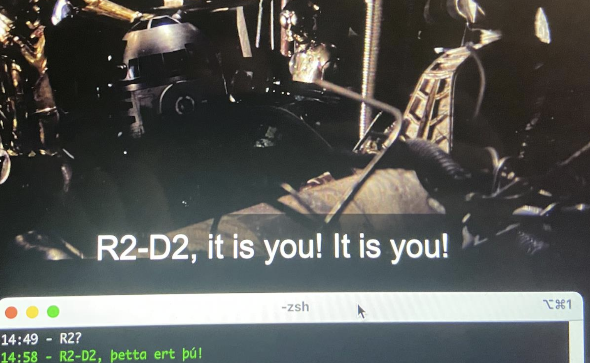

Laravel Zero Caption Player
==

What and Why?
- 
This is a captions player that runs separately from the video in the terminal. It was made using [Laravel Zero](https://laravel-zero.com/) because that is what I use in my day job. I wanted to watch _StarWars:A New Hope_ with subtitles in a foreign language that the streaming service just doesn't have. 


How do I use this?
-
First, clone this repo. Next, go to [https://www.opensubtitles.org/](https://www.opensubtitles.org/) and download an SRT file. After you have cued up the streaming service and paused it, lauch via command line as...

```
./caption do FileName.srt 

```

You can also start it at a particular point using:
```shell
./caption do SW-isl-full.srt --start=13:29
```

You can also have a secondary SRT file to help with language study. 
```shell
./caption do SW-isl-full.srt SW-en.srt --start=4:56

```

Errata
-
It's not perfect and frankly it may not be worth using. This was a toy project I made over a weekend. 


